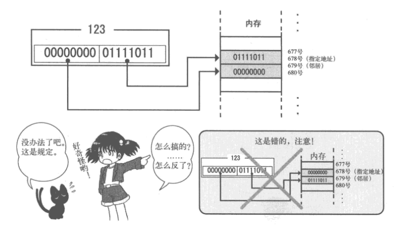

### 
> __启动区 (boot sector)__ 软盘第一个的扇区称为启动区。
> 软盘的512字节就称为一个扇区,计算机首先从最初一个扇区开始读软盘,然后去检查这个扇区最后2个字节内容。如果这最后2个字节不是55 A,计算机会认为这张盘上没有所需的启动程序,就会报一个不能启动的错误。  
> __IPL(initial program loader)__ 启动程序加载器。启动区只有区区512字节,所以把加载操作系统本身的程序放在启动区里。  
> __BYTE, WORD, DWORD__, BYTE=8bit, WORD=16bit, DWORD=32bit  
> __汇编指定内存地址:__  
  

### 简单指令
> __DB__ 'data byte' 直接写入1字节指令
> __DW__ 'data word', 写入2字节
> __DD__ 'data double-word'，写入4字节
> __RESB__ 'reserve byte', 从当前地址空出字节，并填上0x00  
> __MOV__ 'move', 赋值语句
> __ADD__   
> __ORG__ 'origin'起源, 指定一个地址,后面的程序或数据从这个地址值开始分配。
> __JMP__ 'jump', 跳转。
> __entry:__ 标签声明，指定JMP等的跳转目的地。

### 例句  
__MOV BYTE [SI],123__,用内存的"SI寄存器值"号地址来保存"123"这个数。 _"[]"表示访问内存地址。_  

### 寄存器  
__16位寄存器__  
__AX__ accumulator, 累加寄存器  
__CX__ counter, 计数寄存器  
__DX__ data, 数据寄存器  
__BX__ base, 基址寄存器  
__SP__ stack pointer, 栈指针寄存器  
__BP__ base pointer, 基址指针寄存器  
__SI__ source index, 源变址寄存器  
__DI__ destination index, 目的变址寄存器  

__8位寄存器__  
__AL__ 累加寄存器低位(accumulator low)  
__CL__ 计数寄存器低位(counter low)  
__DL__ 数据寄存器低位(data low)  
__BL__ 基址寄存器低位(base low)  
__AH__ 累加寄存器高位(accurmulator high)  
__CH__ 计数寄存器高位(counter high)  
__DH__ 数据寄存器高位(data high)  
__BH__ 基址寄存器高位(base high)  

__32位寄存器__  
BAX, ECX, BDX, BBX, ESP, BP, ESI, EDI
> 32位寄存器的低16位就是上面的16位寄存器了。  

__段寄存器(segment register)__  
__BS__ 附加段寄存器(extra segment)  
__cs__ 代码段寄存器(code segment)  
__8S__ 栈段寄存器(stack segment)  
__D8__ 数据段寄存器(data segment)  
__PS__ 没有名称(segment part 2)  
__GS__ 没有名称(segment part 3)  
