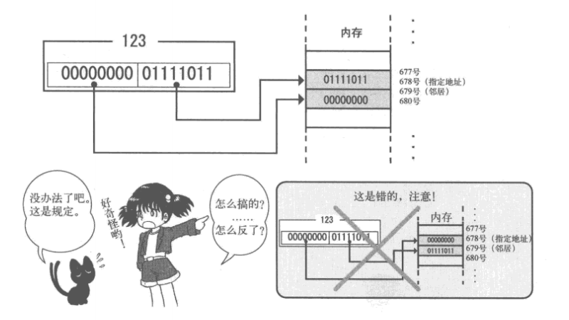

## 零散的知识点

### 名词解释
__Makefile__ Makefile定义了一系列的规则来指定，哪些文件需要先编译，哪些文件需要后编译，哪些文件需要重新编译，甚至于进行更复杂的功能操作，因为makefile就像一个Shell脚本一样，其中也可以执行操作系统的命令。makefile带来的好处就是——“自动化编译”，一旦写好，只需要一个make命令，整个工程完全自动编译，极大的提高了软件开发的效率。make是一个命令工具，是一个解释makefile中指令的命令工具。[Makefile教程](https://blog.csdn.net/weixin_38391755/article/details/80380786)  
__启动区__ (boot sector)软盘第一个的扇区称为启动区。 
软盘的512字节就称为一个扇区,计算机首先从最初一个扇区开始读软盘,然后去检查这个扇区最后2个字节内容。如果这最后2个字节不是55 A,计算机会认为这张盘上没有所需的启动程序,就会报一个不能启动的错误。  
__IPL__ (initial program loader)启动程序加载器。启动区只有区区512字节,所以把加载操作系统本身的程序放在启动区里。
__GDT__  GDT是"global (segment) descriptor table", 全局段号记录表的缩写,将这些数据整齐地排列在内存的某个地方,然后将内存的起始地址和有效设定个数放在CPU内被称作GDTR的特殊寄存器中,设定就完成了。  
__IDT__ IDT是"interrupt descriptor table", 中断记录表。当CPU遇到外部状况变化,或者是内部偶然发生某些错误时,会临时切换过去处理这种突发事件。这就是中断功能。  
__中断__ 拿电脑的键盘来举个例子。以CPU的速度来看,键盘特别慢,只是偶尔动一动。就算是重复按同一个键,一秒钟也很难输入50个字符。而CPU在1/50秒的时间内,能执行200万条指令(CPU主频100MHz时), CPU每执行200万条指令,查询一次键盘的状况就已经足够了。如果查询得太慢,用户输入一个字符时电脑就会半天没反应。  
要是设备只有键盘,用“查询”这种处理方法还好。但事实上还有鼠标、软驱、硬盘、光驱、网卡,声卡等很多需要定期查看状态的设备。其中,网卡还需要CPU快速响应。响应不及时的话,数据就可能接受失败,而不得不再传送一次。如果因为害怕处理不及时而靠查询的方法轮流查看各个设备状态的话, CPU就会穷于应付,不能完成正常的处理。  
正是为解决以上问题,才有了中断机制。各个设备有变化时就产生中断,中断发生后, CPU暂时停止正在处理的任务,并做好接下来能够继续处理的准备,转而执行中断程序。中断程序执行完以后,再调用事先设定好的函数,返回处理中的任务。正是得益于中断机制, CPU可以不用一直查询键盘,鼠标,网卡等设备的状态,将精力集中在处理任务上。  
   
__PIC__ "programmable interrupt controller", 可编程中断控制器。CPU单独只能处理一个中断,这不够用,所以IBM的大叔们在设计电脑时,就在主板上增设了几个辅助芯片。现如今它们已经被集成在一个芯片组里了。  

### 内存相关 
__汇编指定内存地址:__  
 

汇编中所有标号都仅仅是单纯的数字。每个标号对应的数字,是由汇编语言编译器根据ORG指令计算出来的。 
编译器计算出的 __“标号的地方对应的内存地址”就是那个标号的值。__  
所以可以用 "JMP entry" 代替 "JMP 0x7c50"。  
__汇编寻址__ 一般说来,如果能用一个寄存器来表示内存地址的话,当然会很方便,但一个BX只能表示0-0xfff的值,也就是只有0-65535,最大才64K,大家的电脑起码也都有64M内存,或者更多,只用一个寄存器来表示内存地址的话,就只能用64K的内存,这太可惜了。  
于是为了解决这个问题,就增加了一个叫EBX的寄存器,这样就能处理4G内存了。这是CPU能处理的最大内存量,没有任何问题。但EBX的导入是很久以后的事情,在设计BIOS的时代,CPU甚至还没有32位寄存器,所以当时只好设计了一个起辅助作用的段寄存器(segment register)。在指定内存地址的时候,可以使用这个段寄存器。  
我们使用段寄存器时,以 ES:BX 这种方式来表示地址,写成ESx16+BX的内存地址,可以指定1M内存。  
__控制点阵__ _打印条纹图案..._  
先来看看让特定位变成1的功能。这可以通过“或” (OR)运算来实现。  
0100 OR 0010 -> 0110  
1010 OR 0010 -> 1010  
让特定位变成0的功能。这可以通过“与” (AND )运算来实现。  
0100 AND 1101 -> 0100  
1010 AND 1101 -> 1000  
让特定位反转的功能。这可以通过“异或” (XOR)运算来实现。  
0100 XOR 0010 -> 0110
1010 AND 0010 -> 1000
__显示字符__  
 
字符可以用8x16的长方形像素点阵来表示。想象一个下图上数据,然后按下图右边所示的方法置换成0和1,这个方法好像不错。然后根据这些数据在画面上打上点就肯定能显示出字符了。8 “位”是一个字节,而1个字符是16个字节。 _像这种描述文字形状的数据成为字体数据。_  
__内存分段__  
> 使用汇编时，有一个指令ORG。如果不使用ORG指令明确声明程序要读入的内存地址,就不能写出正确的程序来。如果写着ORG 0x1234,但程序却没读入内存的0x1234号,可就不好办了。  
> 发生这种情况是非常麻烦的。最近的操作系统能同时运行多个程序,这一点也不稀奇。这种时候,如果内存的使用范围重叠了怎么办?这可是一件大事。必须让某个程序放弃执行,同时报出一个“因为内存地址冲突,不能执行”的错误信息。但是,这种错误大家见过吗?没有。所以,肯定有某种方法能解决这个问题。这个方法就是分段。  
> 所谓分段,打个比方说,就是按照自己喜欢的方式,将合计4GB的内存分成很多块(block),每一块的起始地址都看作0来处理。这很方便,有了这个功能,任何程序都可以先写上一句ORG 0。像这样分割出来的块,就称为段(segment)。  
__内存分页__  
1页=4kb  
有多少任务就分多少页，还要对内存进行排序。  

### CPU相关
__Intel CPU的态 'mode'__  
系统模式 'ring0'  
应用模式 'ring3'  
中间阶段 'ring1 ring2', 由设备驱动器使用  
__return__  
return的功能,是返回函数被调用位置的一个JMP指令  
return的时候要返回的地址记录在[ESP]  